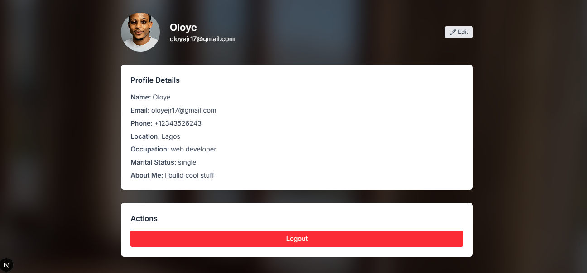
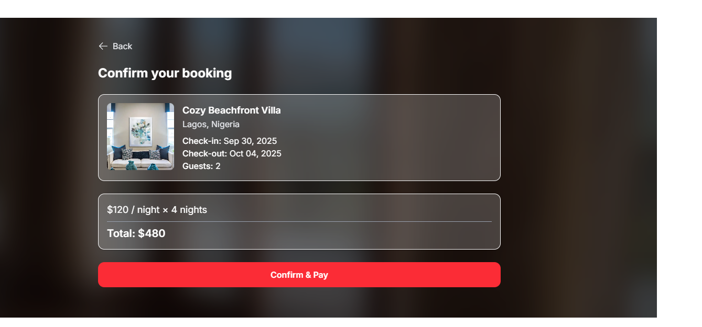
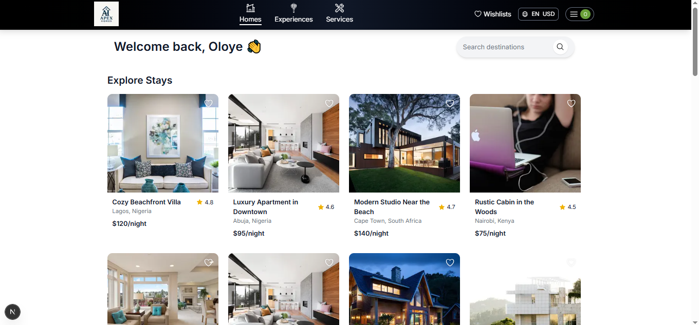
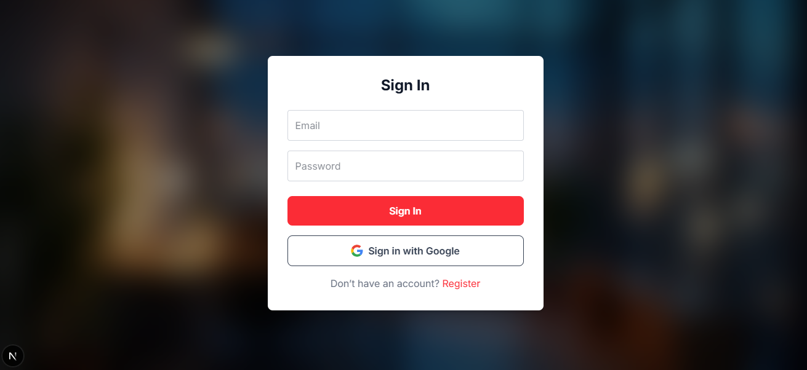
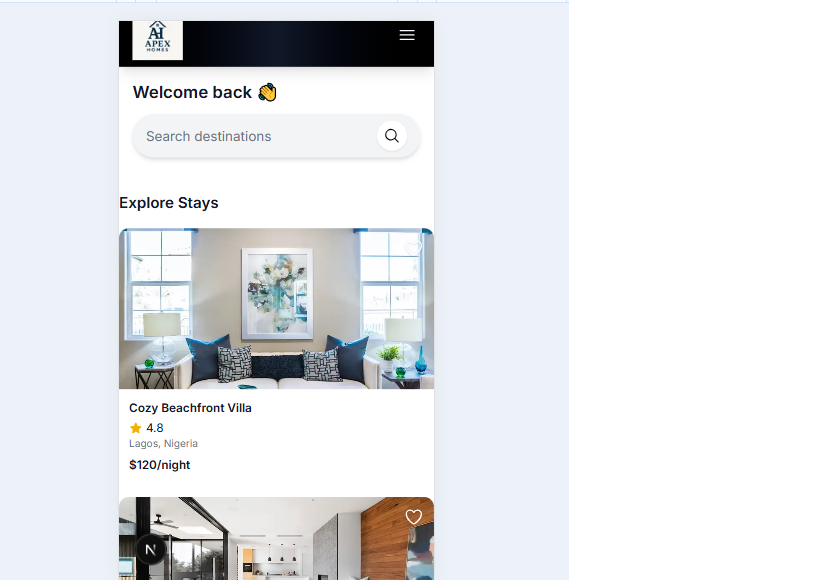

APEX-HOMES

A modern Airbnb-style web application built with **Next.js**, **TypeScript**, **TailwindCSS**, **Prisma**, and **Next-Auth**.  
Users can create accounts, manage profiles, browse listings, and make bookings.

---

## Table of Contents

- [Features](#features)
- [Tech Stack](#tech-stack)
- [Project Structure](#project-structure)
- [Setup & Installation](#setup--installation)
- [Usage](#usage)
- [Screenshots](#screenshots)
- [License](#license)

---

## Features

- User authentication with **Google** and **Email/Password**.
- Profile page with editable user information and profile image.
- Bookings management (upcoming, completed, canceled).
- Responsive design with dark/light-friendly backgrounds.
- Randomized background images for profile page.
- BigInt-safe Prisma database handling.

---

## Tech Stack

- **Frontend:** Next.js, React, TypeScript, TailwindCSS, Heroicons  
- **Backend:** Next.js API Routes, Prisma ORM, SQLite  
- **Authentication:** Next-Auth  
- **Image Upload:** API route for profile images  
- **Database:** SQLite (local dev)

---

## Project Structure

app/
├─ api/
│ ├─ auth/ # Next-Auth API routes
│ ├─ user/ # Profile and user-related API routes
├─ components/
│ ├─ RandomBgWrapper.tsx
│ └─ ... # Other reusable components
├─ page.tsx # Homepage
lib/
├─ auth.ts # Next-Auth helpers
├─ prisma.ts # Prisma client
prisma/
├─ schema.prisma # Database schema
public/
├─ images/ # Backgrounds and assets

---

## Setup & Installation

1. **Clone the repository**

git clone https://github.com/Oloyejr17/my-airbnb-website.git
cd my-airbnb-website
Install dependencies

bash
Copy code
npm install
Set up environment variables

Create a .env.local file in the root:

DATABASE_URL="file:./dev.db"
NEXTAUTH_SECRET="your_nextauth_secret"
GOOGLE_CLIENT_ID="your_google_client_id"
GOOGLE_CLIENT_SECRET="your_google_client_secret"
Generate Prisma client

npx prisma generate
Run migrations

npx prisma migrate dev --name init
Start the development server

npm run dev
Access the app at http://localhost:3000

Usage
Sign up or log in using Google or email.

Update profile details on the profile page.

Browse listings and manage bookings.

Logout using the button in the profile actions section.

License

This project is for educational purposes. You can use it freely, but do not redistribute as your own commercial project.